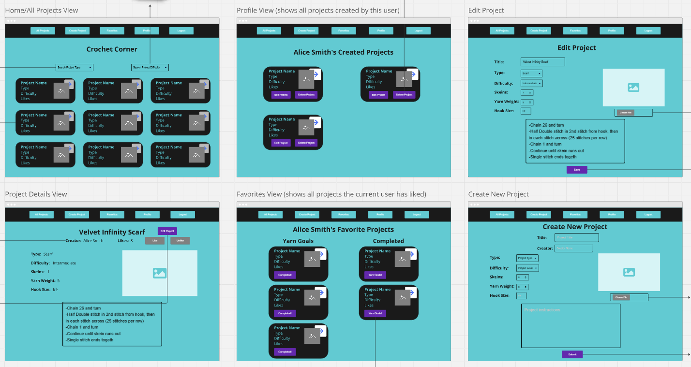

# Welcome to Crochet Corner

A social platform for crochet enthusiasts to share projects they created, track progress, and connect with fellow crafters.

## Purpose

Crochet Corner provides a dedicated space for yarn crafters of all skill levels to document and share their work and to engage and find inspiration within a crafting community, addressing the need for project organization and social connection. 

## Features

* Allows users to create, edit, and delete their own crochet projects
* Allows users to like and save their favorite projects, and track their own completion status of favorite projects
* Filter projects by the type of craft (hat, scarf, blanket, pet bed)
* Filter projects by the difficulty level of the craft (beginner, intermediate, advanced)
* View their own profile listing all their own projects, and other users' profiles displaying their projects
* View details of any project that include hook size, yarn weight, skeins, and instructions

## Technologies Used

* React
* JavaScript
* Radix
* JSON server
* HTML
* CSS

## ERD


## Wireframe 


## Setup
1. Clone the repository
```sh
git clone git@github.com:SabraKoz/crochet-corner.git
cd crochet-corner
```
2. Install packages:
```sh
npm install
npm install json-server
npm install @radix-ui/themes
```
3. Start JSON server database:
```sh
cd src
cd api
json-server -p 8088 database.json
```
4. Launch application:
* In a new terminal: 
```sh
cd crochet-corner
npm run dev
```
* Copy an email address from the users table in the database, or register a new user account to begin browsing and sharing yarn projects!

## Creator

Sabra Kozlina 

[GitHub](https://github.com/SabraKoz)

[LinkedIn](https://www.linkedin.com/in/sabra-kozlina-baa0911b7)